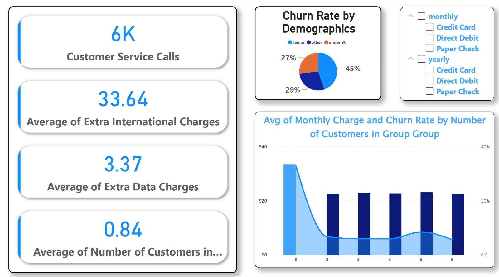
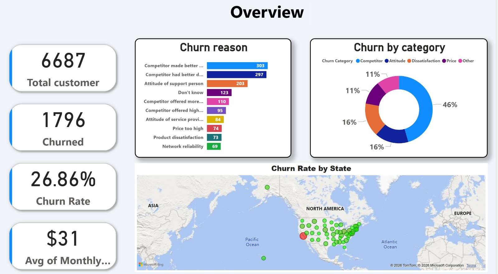
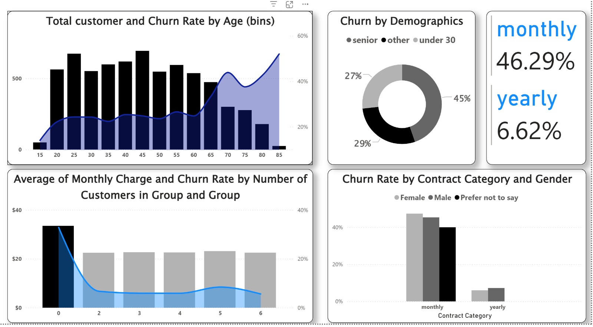
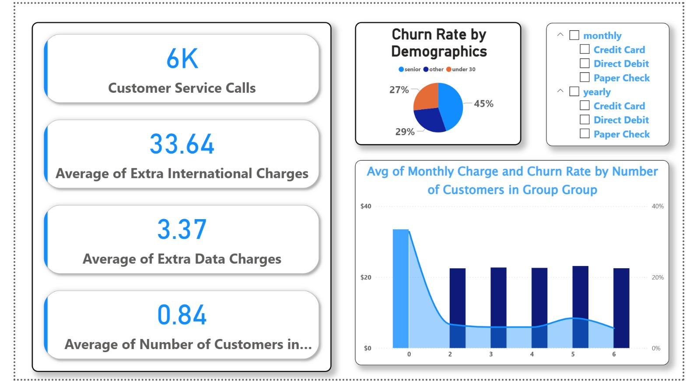

# Customer Churn Analysis - Power BI

This project analyzes customer churn using Power BI.
It focuses on identifying churn rate, customer behavior, and main churn reasons.

## Dashboard Screenshots

### Overview

### Dashboard 2

### Dashboard 3

### Dashboard 4

## Highlights
- Total customers: 6,687
- Churn rate: 26.86%
- Monthly contracts have the highest churn
- Competitors and service attitude are main churn reasons

## Tool
- Power BI Desktop

## Author
Ahmed Mohamed Sayedahmed
